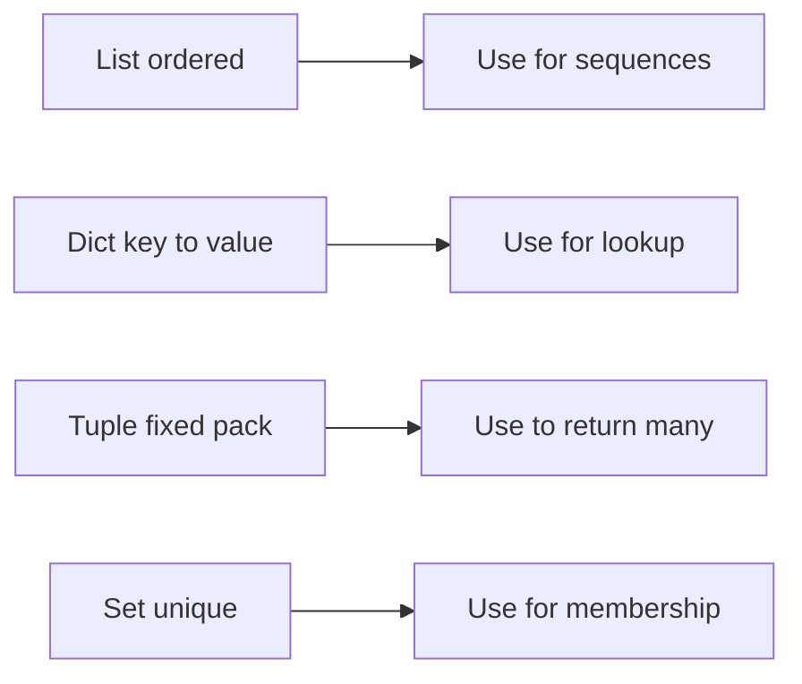
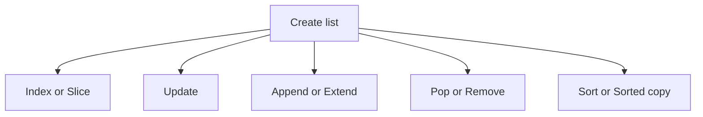
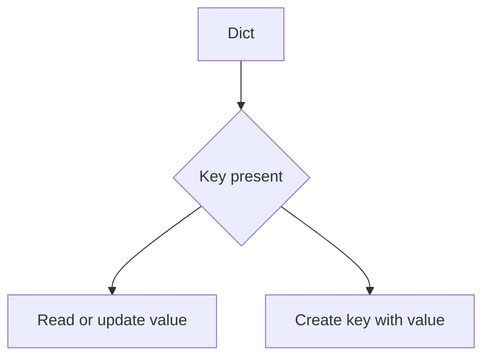
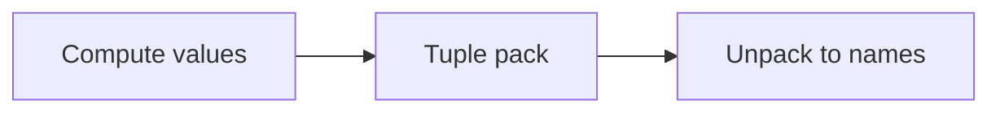
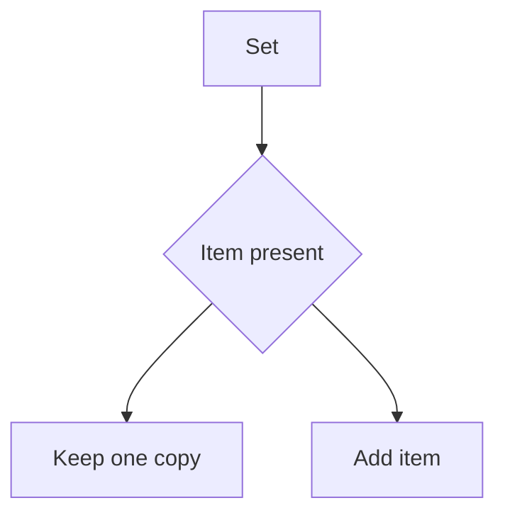
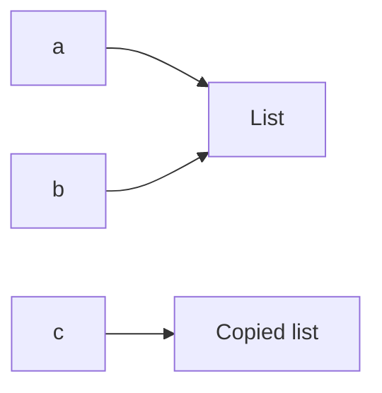

# Data Structures — Lists, Dictionaries, Tuples, and Sets

Collections let your program hold **many values** and manipulate them efficiently. Mastering the four core types—**list**, **dict**, **tuple**, **set**—covers most real programs you’ll write.

We’ll focus on the 20% that drives 80% of use: how to choose the right structure, the operations you’ll use daily, and the mistakes to avoid.

---

## 1) Why Collections?

### Concept
A single variable holds one value. Collections hold **multiple**:
- **List**: ordered sequence, duplicates allowed, **mutable**.
- **Dict**: mapping **key → value**, fast lookups, **mutable**.
- **Tuple**: fixed grouping, ordered, **immutable**.
- **Set**: **unique** items, no order, fast membership, **mutable**.

Choose based on your question:
- “What is the nth item?” → **list**
- “Given key, what’s the value?” → **dict**
- “Return multiple results together.” → **tuple**
- “Is x in the group? Remove duplicates.” → **set**

### Diagram


---

## 2) Lists — Ordered, Mutable Sequences

### Concept
Lists keep items in a specific order and let you **insert**, **replace**, **delete**, and **iterate**. They’re your default for “a bunch of things in order.”

### Syntax
```python
# literal and basic access
nums = [10, 20, 30]
names = ["Ada", "Grace"]
first = nums[0]        # 10
last  = nums[-1]       # 30

# slicing: start inclusive, stop exclusive
sub = nums[0:2]        # [10, 20]
copy1 = nums[:]        # shallow copy
step = nums[::2]       # every second element

# update and growth
nums[1] = 25           # replace
nums.append(40)        # add to end
nums.extend([50, 60])  # add many
nums.insert(1, 15)     # insert at index
removed = nums.pop()   # remove and return last
nums.remove(25)        # remove first matching value

# sorting
nums.sort()            # in place
sorted_copy = sorted(nums, reverse=True)  # new list
```

### Diagram


### Example
```python
scores = [72, 88, 91, 78, 88]
scores.append(85)            # [72, 88, 91, 78, 88, 85]
scores[3] = 80               # [72, 88, 91, 80, 88, 85]

# compute average of top 3 scores
sorted_scores = sorted(scores, reverse=True)
top3 = sorted_scores[:3]
avg_top3 = sum(top3) / len(top3)
print("Top 3:", top3, "Avg:", round(avg_top3, 2))
```

### Detailed explanation
- **Slicing** uses half-open ranges (`start` inclusive, `stop` exclusive) so segments compose cleanly.
- `append` and `extend` differ: `append([50, 60])` adds **one list**; `extend([50, 60])` adds **two elements**.
- `sorted` returns a new list (non-destructive); `list.sort()` mutates in place.

### Pitfalls & notes
- **Modifying while iterating** can skip elements. Iterate a **copy** (e.g., `for x in items[:]`) or build a new list via **comprehension**.
- **Copy vs alias:** `b = a` aliases the same list. Use `a.copy()` or `a[:]` for a shallow copy.
- **List replication trap:** `grid = [[0]*3]*3` creates **three references** to the same inner list. Prefer: `grid = [[0 for _ in range(3)] for _ in range(3)]`.

### Exercise
Given `temperatures = [18, 21, 19, 25, 17]`:
1) Replace the value at index 2 with `20`.  
2) Append `22`.  
3) Print the new **median** (after sorting) and the updated list.

---
```{admonition} Try it yourself (click to open)
:class: dropdown
<div style="margin: 0.5rem 0 1rem;">
<iframe
  src="https://codapi.org/embed/?sandbox=python&code=data%3A%3Bbase64%2CBcHJCQAgDADBVhYsyrfEgMEjEvRh984kcthRnl%2FEq9K0BGVVZJh04i6OIz63Df0%3D"
  width="100%"
  height="420"
  frameborder="0"
  loading="lazy"
  allow="clipboard-read; clipboard-write"
  title="Python Practice Sandbox">
</iframe>
</div>
```

## 3) Dictionaries — Fast Key → Value Mapping

### Concept
Dictionaries answer: “Given a **key**, what’s the **value**?” They’re ideal for lookups, counters, and structured records. Keys must be **hashable** (immutable types like `str`, `int`, `tuple`).

### Syntax
```python
user = {"name": "Sam", "age": 25}  # literal
user["age"] = 26                   # create or update
n = user.get("score", 0)           # read with default
exists = "name" in user            # membership by key
del user["name"]                   # delete a key

# iteration
for k in user:            # keys
    print(k)

for k, v in user.items(): # key and value
    print(k, v)

# merging (3.9+)
a = {"x": 1}
b = {"y": 2}
c = a | b                 # {'x': 1, 'y': 2}
```

### Diagram


### Example — word counting
```python
words = ["pen", "bag", "pen", "pen", "book", "bag"]
counts = {}

for w in words:
    if w in counts:
        counts[w] += 1
    else:
        counts[w] = 1

print(counts)  # {'pen': 3, 'bag': 2, 'book': 1}
```

### Detailed explanation
- Use `in` to test **keys** quickly.  
- Prefer `get` when a key may be missing: `counts[w] = counts.get(w, 0) + 1`.  
- Dicts preserve **insertion order** (CPython 3.7+), which makes iteration predictable for reports.

### Pitfalls & notes
- **KeyError** on missing keys with `user["score"]`; use `get` for defaults.  
- **Unhashable keys** (e.g., lists) are invalid; use tuples for composite keys: `key = (city, date)`.  
- **Views** (`keys()`, `values()`, `items()`) are dynamic; they reflect changes to the dict.

### Exercise
Create `prices = {"apple": 2.0, "banana": 1.5, "grape": 3.0}`.  
Compute the total for `cart = ["banana", "banana", "grape", "pear"]` where unknown items cost `0`. Print a line-item report and the total.

---
```{admonition} Try it yourself (click to open)
:class: dropdown
<div style="margin: 0.5rem 0 1rem;">
<iframe
  src="https://codapi.org/embed/?sandbox=python&code=data%3A%3Bbase64%2CBcHJCQAgDADBVhYsyrfEgMEjEvRh984kcthRnl%2FEq9K0BGVVZJh04i6OIz63Df0%3D"
  width="100%"
  height="420"
  frameborder="0"
  loading="lazy"
  allow="clipboard-read; clipboard-write"
  title="Python Practice Sandbox">
</iframe>
</div>
```

## 4) Tuples — Fixed, Immutable Grouping

### Concept
Tuples group a small, fixed number of related values. They’re immutable and excellent for **returning multiple results** and **unpacking** into names.

### Syntax
```python
pt = (3, 4)            # tuple literal
x, y = pt              # unpack
single = (42,)         # one-element tuple requires a comma

def min_max(values):
    return min(values), max(values)

lo, hi = min_max([2, 9, 5])
```

### Diagram


### Example
```python
def split_name(full):
    parts = full.split()
    first = parts[0]
    last = parts[-1]
    return first, last

f, l = split_name("Ada Lovelace")
print(f, l)  # Ada Lovelace
```

### Detailed explanation
- Returning `(first, last)` lets callers assign both in one line with clear intent.
- Immutability is a feature: tuples are safe as dict **keys** and set **elements** (they are hashable if their items are hashable).

### Pitfalls & notes
- `(x)` is just `x`; use `(x,)` for a one-element tuple.  
- Tuples are not for large, evolving collections—prefer lists for that. If you need names, you’ll learn `dataclass` later.

### Exercise
Write `rectangle_stats(w, h)` that returns `(area, perimeter)`.  
Call it and unpack into `a, p`, then print both with labels.

---
```{admonition} Try it yourself (click to open)
:class: dropdown
<div style="margin: 0.5rem 0 1rem;">
<iframe
  src="https://codapi.org/embed/?sandbox=python&code=data%3A%3Bbase64%2CBcHJCQAgDADBVhYsyrfEgMEjEvRh984kcthRnl%2FEq9K0BGVVZJh04i6OIz63Df0%3D"
  width="100%"
  height="420"
  frameborder="0"
  loading="lazy"
  allow="clipboard-read; clipboard-write"
  title="Python Practice Sandbox">
</iframe>
</div>
```

## 5) Sets — Unique Items and Fast Membership

### Concept
Sets store **unique** elements with very fast `in` checks. Use sets to remove duplicates, test membership, and compute unions or intersections.

### Syntax
```python
items = {"pen", "bag", "book"}   # literal
empty = set()                    # empty set; {} is an empty dict

items.add("pen")                 # no change if already present
items.remove("bag")              # KeyError if missing
items.discard("bag")             # safe remove, no error
exists = "book" in items

# set algebra
A = {"Mon", "Tue", "Wed"}
B = {"Wed", "Thu", "Fri"}
union = A | B
inter = A & B
diff  = A - B
sym   = A ^ B
```

### Diagram


### Example
```python
emails = ["a@x.com", "b@x.com", "a@x.com", "c@x.com"]
unique = set(emails)
print("Original:", len(emails), "Unique:", len(unique))
print("Have b@x.com?", "b@x.com" in unique)
```

### Detailed explanation
- Converting a list to a set removes duplicates automatically.  
- Set algebra mirrors everyday logic: union (either), intersection (both), difference (in A not in B), symmetric difference (in exactly one).

### Pitfalls & notes
- Set elements must be **hashable** (no lists or dicts inside).  
- Sets are **unordered**; do not rely on iteration order.  
- `remove` vs `discard`: use `discard` when you’re unsure whether the item exists.

### Exercise
Given `week1 = {"Mon", "Tue", "Wed"}` and `week2 = {"Wed", "Thu", "Fri"}`:
1) Print the union and intersection.  
2) Print days that are in `week1` but not `week2`.  
3) Is "Sat" in the union?

---
```{admonition} Try it yourself (click to open)
:class: dropdown
<div style="margin: 0.5rem 0 1rem;">
<iframe
  src="https://codapi.org/embed/?sandbox=python&code=data%3A%3Bbase64%2CBcHJCQAgDADBVhYsyrfEgMEjEvRh984kcthRnl%2FEq9K0BGVVZJh04i6OIz63Df0%3D"
  width="100%"
  height="420"
  frameborder="0"
  loading="lazy"
  allow="clipboard-read; clipboard-write"
  title="Python Practice Sandbox">
</iframe>
</div>
```

## 6) Mutability, Aliasing, and Copying

### Concept
- **Lists and dicts** are mutable (in-place changes).  
- Assignment copies the **reference** (aliasing), not the contents.  
- Use **shallow copies** for a new container with the same top-level items.

### Syntax
```python
# aliasing
a = [1, 2]
b = a
b.append(3)
# a is now [1, 2, 3] too

# shallow list copies
c = a.copy()       # or list(a) or a[:]
c.append(4)        # a unchanged

# dict shallow copy
d = {"x": 1, "tags": ["a"]}
e = d.copy()       # shallow
e["x"] = 2         # d unchanged
```

### Diagram


### Example (nested caution)
```python
original = {"name": "Sam", "skills": ["py", "sql"]}
alias = original
clone = original.copy()            # shallow copy

alias["name"] = "Samuel"           # affects original
clone["name"] = "S."               # no effect on original

# but both original and clone share the same list object in "skills"
original["skills"].append("git")
print(original["skills"])  # ['py', 'sql', 'git']
print(clone["skills"])     # ['py', 'sql', 'git']  (shared)
```

### Detailed explanation
- Shallow copy duplicates the **outer** container, but inner objects are shared.  
- For most beginner tasks, shallow copy is enough. When you truly need to duplicate nested structures, learn `copy.deepcopy` (later).

### Pitfalls & notes
- Be cautious with list replication for 2D grids: `[[0]*3]*3` aliases rows. Use a comprehension to build independent rows.

### Exercise
Start with `data = {"scores": [10, 20]}`.  
Create `a = data` and `b = data.copy()`.  
Append `30` to `a["scores"]`; then set `b["scores"] = [10, 20, 30]`.  
Print all three objects and explain the differences.

---
```{admonition} Try it yourself (click to open)
:class: dropdown
<div style="margin: 0.5rem 0 1rem;">
<iframe
  src="https://codapi.org/embed/?sandbox=python&code=data%3A%3Bbase64%2CBcHJCQAgDADBVhYsyrfEgMEjEvRh984kcthRnl%2FEq9K0BGVVZJh04i6OIz63Df0%3D"
  width="100%"
  height="420"
  frameborder="0"
  loading="lazy"
  allow="clipboard-read; clipboard-write"
  title="Python Practice Sandbox">
</iframe>
</div>
```

## 7) Integrated Mini-Project — Word Frequency Report

### Concept
Combine lists, dicts, and sets to analyze text.

### Example
```python
text = "bag pen bag book pen pen"
words = text.split()                         # list
vocab = set(w.lower() for w in words)        # set, dedupe, normalize

counts = {}
for w in words:
    w = w.lower()
    counts[w] = counts.get(w, 0) + 1         # dict counting pattern

print("Vocab:", sorted(vocab))
print("Counts:")
for w in sorted(counts):
    print(f"  {w}: {counts[w]}")

# top word (simple pass)
top_word = ""
top_count = 0
for w in counts:
    if counts[w] > top_count:
        top_word = w
        top_count = counts[w]
print("Top:", top_word, top_count)
```

### Detailed explanation
- `split()` tokenizes to a **list**.  
- A **set** removes duplicates and is useful for quick membership and reporting.  
- A **dict** tracks frequencies with a concise `get` fallback.  
- One pass finds the maximum without sorting, which is efficient for large inputs.

### Exercise
Enhance the report:
1) Remove punctuation and normalize case.  
2) Print words that occur **once** only.  
3) Print the top **two** words and their counts.

---
```{admonition} Try it yourself (click to open)
:class: dropdown
<div style="margin: 0.5rem 0 1rem;">
<iframe
  src="https://codapi.org/embed/?sandbox=python&code=data%3A%3Bbase64%2CBcHJCQAgDADBVhYsyrfEgMEjEvRh984kcthRnl%2FEq9K0BGVVZJh04i6OIz63Df0%3D"
  width="100%"
  height="420"
  frameborder="0"
  loading="lazy"
  allow="clipboard-read; clipboard-write"
  title="Python Practice Sandbox">
</iframe>
</div>
```

## Performance snapshot (helpful intuition)
- **List** indexing O(1), insert/delete at **end** O(1), at **front/middle** O(n).  
- **Dict** and **set** lookups/inserts/deletes average O(1) (hash-based).  
- Sorting a list is O(n log n).

---

## Mastery Checklist (20% that powers 80%)
- I can pick the right collection for the job.  
- I slice lists safely and know when to copy vs alias.  
- I use dicts for key→value problems and the `get` pattern for defaults.  
- I return and unpack tuples for multiple results.  
- I use sets for uniqueness, membership, and simple algebra.  
- I understand mutability and shallow copy behavior with nested data.
