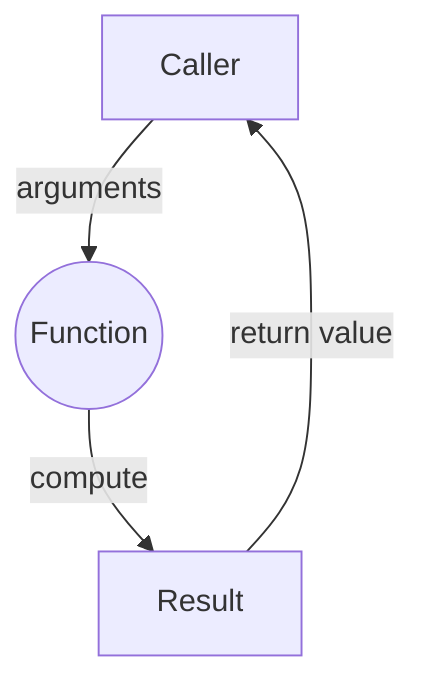
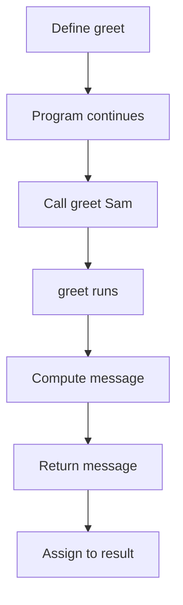
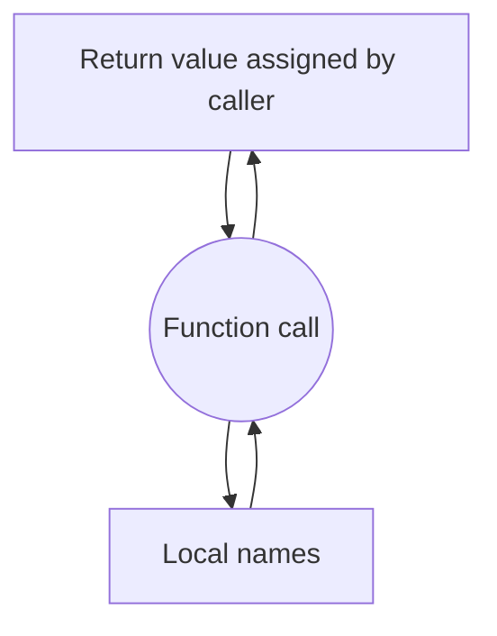
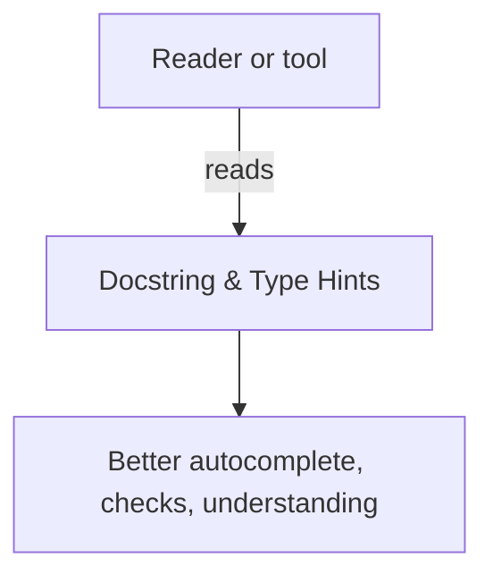

# Functions — Writing Reusable Code 

Functions let you **name a task**, **reuse it**, and **reason locally**. They turn long scripts into small, dependable building blocks. Master the essentials here—definition, parameters, return values, and scope—and you’ll write clearer code faster.

---

## 1) What Is a Function?

### Concept
A **function** is a named block of code that performs a specific task. You **call** the function to run it, optionally passing **arguments** (inputs) and optionally receiving a **return value** (output).

Good functions share three properties:

1. **Single purpose.** Do one thing clearly.  
2. **Clear interface.** Inputs (parameters) and outputs (return value) are explicit.  
3. **No hidden surprises.** Avoid unnecessary global state or side effects unless that is the function’s job.

Why this matters: Functions reduce mental load. When a function is well named and small, you can treat it as a black box and focus on the problem at hand.

### Syntax
```python
def name(parameter1, parameter2=default_value):
    # One-line summary of what the function does.
    # body
    return result  # optional
```

### Diagram


### Example
```python
def area_of_rectangle(width, height):
    # Return the area (width * height).
    return width * height

print(area_of_rectangle(3, 4))              # 12
print(area_of_rectangle(width=5, height=2)) # 10
```

### Detailed explanation
- `def area_of_rectangle(width, height):` defines a function with two **parameters**.  
- Calling `area_of_rectangle(3, 4)` passes **arguments** to those parameters.  
- `return width * height` sends a value back to the caller; if a function doesn’t `return`, Python returns `None`.  
- Keyword arguments (`width=5`) make calls self-documenting and order-independent.

### Exercise
Write a function `fahrenheit_to_celsius(f)` that returns the Celsius value. Then explain what happens if you forget `return`.

---

```{admonition} Try it yourself (click to open)
:class: dropdown
<div style="margin: 0.5rem 0 1rem;">
<iframe
  src="https://codapi.org/embed/?sandbox=python&code=data%3A%3Bbase64%2CBcHJCQAgDADBVhYsyrfEgMEjEvRh984kcthRnl%2FEq9K0BGVVZJh04i6OIz63Df0%3D"
  width="100%"
  height="420"
  frameborder="0"
  loading="lazy"
  allow="clipboard-read; clipboard-write"
  title="Python Practice Sandbox">
</iframe>
</div>
```

## 2) Defining and Calling Functions

### Concept
Define a function once and call it many times. A good function name plus a docstring communicates the intent; the body implements it.

### Syntax
```python
def greet(name):
    """Return a polite greeting for the given name."""
    message = f"Hello, {name}."
    return message

result = greet("Sam")
```

### Diagram


### Example
```python
def is_even(n):
    # Return True if n is even.
    return n % 2 == 0

for x in range(1, 6):
    if is_even(x):
        print(x, "is even")
```
### Detailed explanation
- `is_even` hides the parity test behind a meaningful name; the loop reads like English.  
- The function returns a boolean; using it inside `if` is natural.  
- Encapsulation like this eliminates duplicated ad‑hoc checks across your code.

### Exercise
Write `is_valid_username(s)` that returns `True` only if `s` is at least 3 chars and contains no spaces. Test it in a `for` loop over a small list of examples.

---

```{admonition} Try it yourself (click to open)
:class: dropdown
<div style="margin: 0.5rem 0 1rem;">
<iframe
  src="https://codapi.org/embed/?sandbox=python&code=data%3A%3Bbase64%2CBcHJCQAgDADBVhYsyrfEgMEjEvRh984kcthRnl%2FEq9K0BGVVZJh04i6OIz63Df0%3D"
  width="100%"
  height="420"
  frameborder="0"
  loading="lazy"
  allow="clipboard-read; clipboard-write"
  title="Python Practice Sandbox">
</iframe>
</div>
```

## 3) Parameters and Arguments (Positional, Keyword, Defaults)

### Concept
A **parameter** is a named variable in the function definition; an **argument** is the value you pass when calling. Use **positional arguments** for essential inputs in a natural order, and **keyword arguments** for clarity or for optional inputs with **default values**.

### Syntax
```python
def power(base, exponent=2):     # exponent has a default
    return base ** exponent

power(3)                    # 9  (uses default exponent=2)
power(2, 5)                 # 32 (positional)
power(base=2, exponent=5)   # 32 (keyword)
```


### Example
```python
def clip(value, lower=0, upper=100):
    """Return value limited to the inclusive range [lower, upper]."""
    if value < lower:
        return lower
    elif value > upper:
        return upper
    return value

print(clip(120))              # 100
print(clip(-5, lower=-10))    # -5
print(clip(50, upper=40))     # 40
```
### Detailed explanation
- Defaults (`lower=0`, `upper=100`) make common cases short while still allowing customization.  
- Returning early on each boundary keeps the logic flat and readable.  
- Keyword arguments let the caller specify only what they need (`lower=-10`) without remembering parameter order.

### Exercise
Write `percent(part, whole=100)` that returns `(part / whole) * 100`. Handle `whole == 0` by returning `0` (avoid errors). Demonstrate positional and keyword calls.

---

```{admonition} Try it yourself (click to open)
:class: dropdown
<div style="margin: 0.5rem 0 1rem;">
<iframe
  src="https://codapi.org/embed/?sandbox=python&code=data%3A%3Bbase64%2CBcHJCQAgDADBVhYsyrfEgMEjEvRh984kcthRnl%2FEq9K0BGVVZJh04i6OIz63Df0%3D"
  width="100%"
  height="420"
  frameborder="0"
  loading="lazy"
  allow="clipboard-read; clipboard-write"
  title="Python Practice Sandbox">
</iframe>
</div>
```

## 4) Return Values (Including Multiple Results)

### Concept
A function can return **one** value (most common) or **a tuple** that you can unpack. Prefer returning values over printing inside the function—printing is a side effect and makes testing harder.

### Syntax
```python
def divide(a, b):
    if b == 0:
        return None, "division by zero"
    return a / b, None

result, error = divide(10, 2)
```

### Example
```python
def min_max(values):
    """Return the smallest and largest numbers in a non-empty list."""
    smallest = largest = values[0]
    for v in values[1:]:
        if v < smallest:
            smallest = v
        if v > largest:
            largest = v
    return smallest, largest

lo, hi = min_max([7, 2, 9, 3])
print(lo, hi)  # 2 9
```
### Detailed explanation
- Initializing both `smallest` and `largest` to the first element avoids sentinel values and works for any numeric list.  
- Unpacking `lo, hi = ...` makes the calling code readable.  
- Returning values (not printing) allows the caller to decide what to do: print, log, assert, or reuse.

### Exercise
Write `stats(values)` that returns `(count, total, average)` for a non-empty list of numbers. Explain why returning `0` for average on an empty list may be misleading and how you’d handle it.

---

```{admonition} Try it yourself (click to open)
:class: dropdown
<div style="margin: 0.5rem 0 1rem;">
<iframe
  src="https://codapi.org/embed/?sandbox=python&code=data%3A%3Bbase64%2CBcHJCQAgDADBVhYsyrfEgMEjEvRh984kcthRnl%2FEq9K0BGVVZJh04i6OIz63Df0%3D"
  width="100%"
  height="420"
  frameborder="0"
  loading="lazy"
  allow="clipboard-read; clipboard-write"
  title="Python Practice Sandbox">
</iframe>
</div>
```

## 5) Scope and State (Local vs Global)

### Concept
**Local variables** exist only inside a function; **global variables** live at module level. Prefer passing data **into** functions and returning results **out**. Avoid `global` unless a function’s purpose is explicitly to modify module-wide state.

A helpful mental model is **LEGB** (Local, Enclosing, Global, Built-in) for name lookup order.

### Syntax
```python
counter = 0  # global

def step(size=1):
    # avoid writing: global counter (if possible)
    # prefer: return the change and let caller update state
    return size
```

### Diagram


### Example
```python
def add_prefix(text, prefix="[INFO] "):
    """Return prefixed text without mutating external state."""
    return prefix + text

msg = add_prefix("System started")
print(msg)  # [INFO] System started
```
### Detailed explanation
- The function does not depend on or modify any global variable; it only uses its inputs to compute an output.  
- This **purity** makes testing simple: same inputs → same output, no hidden interactions.

### Exercise
Refactor a function that prints directly to instead return a string. Explain how this change improves testability and reuse.

---

```{admonition} Try it yourself (click to open)
:class: dropdown
<div style="margin: 0.5rem 0 1rem;">
<iframe
  src="https://codapi.org/embed/?sandbox=python&code=data%3A%3Bbase64%2CBcHJCQAgDADBVhYsyrfEgMEjEvRh984kcthRnl%2FEq9K0BGVVZJh04i6OIz63Df0%3D"
  width="100%"
  height="420"
  frameborder="0"
  loading="lazy"
  allow="clipboard-read; clipboard-write"
  title="Python Practice Sandbox">
</iframe>
</div>
```

## 6) Docstrings and Type Hints (Clarity for Humans and Tools)

### Concept
A **docstring** (triple-quoted string at the top of the function) documents behavior, parameters, and return values. **Type hints** annotate expected types for tools and readers; they don’t enforce types at runtime, but improve clarity and editor support.

### Syntax
```python
def normalize(text: str, *, lower: bool = True) -> str:
    """
    Return a normalized version of text.
    - Strips surrounding whitespace
    - Optionally lowercases
    """
    s = text.strip()
    return s.lower() if lower else s
```

### Diagram


### Example
```python
def pct(part: float, whole: float) -> float:
    """Return part as a percentage of whole. Returns 0 if whole is 0."""
    return 0.0 if whole == 0 else (part / whole) * 100
```
### Detailed explanation
- The type hints `float` → `float` tell the reader what’s expected, but you can still call with ints because Python will coerce where appropriate.  
- The docstring states the edge-case behavior up front (whole == 0), removing ambiguity.

### Exercise
Add a docstring and type hints to your earlier `stats(values)` function. Explain how you would document behavior for empty input.

---

```{admonition} Try it yourself (click to open)
:class: dropdown
<div style="margin: 0.5rem 0 1rem;">
<iframe
  src="https://codapi.org/embed/?sandbox=python&code=data%3A%3Bbase64%2CBcHJCQAgDADBVhYsyrfEgMEjEvRh984kcthRnl%2FEq9K0BGVVZJh04i6OIz63Df0%3D"
  width="100%"
  height="420"
  frameborder="0"
  loading="lazy"
  allow="clipboard-read; clipboard-write"
  title="Python Practice Sandbox">
</iframe>
</div>
```

## 7) Small Integrated Example — “Text Stats” CLI

### Concept
Compose small functions to build a simple tool. Each function has a single job; the `main` function orchestrates.

### Syntax (structure)
```python
# def helpers...
# def main():
#     read input
#     call helpers
#     print results
# if __name__ == "__main__": main()
```

### Example
```python
def count_words(text: str) -> int:
    """Return number of words (split on whitespace)."""
    return len(text.split())

def count_chars(text: str) -> int:
    """Return number of non-space characters."""
    return sum(1 for ch in text if not ch.isspace())

def summarize(text: str):
    """Return (words, chars) for given text."""
    return count_words(text), count_chars(text)

def main():
    s = input("Enter a line: ").strip()
    words, chars = summarize(s)
    print(f"Words: {words} | Chars (no spaces): {chars}")

if __name__ == "__main__":
    main()
```
### Detailed explanation
- `count_words` and `count_chars` are small, pure functions; they can be tested in isolation.  
- `summarize` composes the two results, returning a tuple the caller can unpack.  
- `main` owns input/output; helpers own computation. This separation keeps the core logic reusable outside the CLI.

### Exercise
Extend `summarize` to also return the length of the **longest** word. Where does that logic belong and why?

---

```{admonition} Try it yourself (click to open)
:class: dropdown
<div style="margin: 0.5rem 0 1rem;">
<iframe
  src="https://codapi.org/embed/?sandbox=python&code=data%3A%3Bbase64%2CBcHJCQAgDADBVhYsyrfEgMEjEvRh984kcthRnl%2FEq9K0BGVVZJh04i6OIz63Df0%3D"
  width="100%"
  height="420"
  frameborder="0"
  loading="lazy"
  allow="clipboard-read; clipboard-write"
  title="Python Practice Sandbox">
</iframe>
</div>
```

## Mastery Checklist (20% that powers 80%)
- I define small, single-purpose functions with clear names and docstrings.  
- I know the difference between parameters and arguments, and I use defaults and keywords for clarity.  
- I return values instead of printing inside helpers.  
- I understand scope (prefer passing data over using globals).  
- I use type hints to clarify interfaces.  
- I can compose multiple small functions into a simple program.

