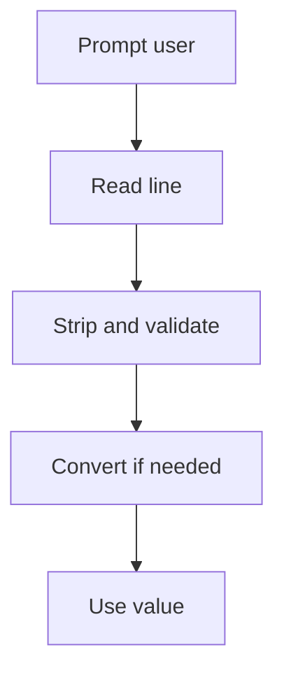
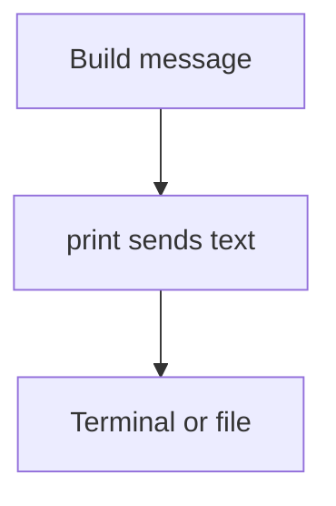
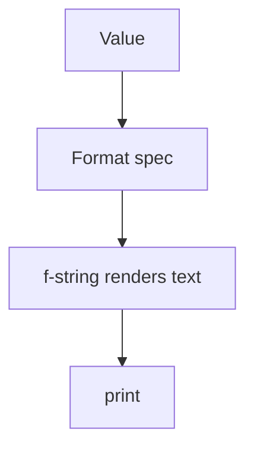
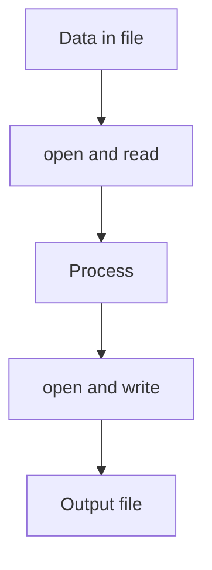

# Input and Output — Communicating with the Machine

Input and output create a **feedback loop**: your program asks, the user responds, and the program replies. Mastering this loop is how you make software **interactive**, **inspectable**, and **useful**.

We’ll cover the essentials you’ll use constantly:
- Interactive input with `input()`
- Clear, formatted output with `print()` and f-strings
- Reading from and writing to files with `open(...)` and a context manager

---

## 1) Interactive Input with `input()`

### Concept
`input()` **pauses** your program and waits for the user to type a line and press Enter. It **returns a string** (without the trailing newline). If you need a number, **convert** it safely.

Two habits keep input robust:
1) **Strip whitespace** (`.strip()`) before validating or converting.  
2) **Validate before using** (or use `try/except` if you convert directly).

### Syntax
```python
text = input("Prompt: ").strip()   # returns str
# convert with care
n = int(text)                      # may raise ValueError
x = float(text)                    # may raise ValueError
```

### Diagram


### Example
```python
name = input("Your name: ").strip()
age_text = input("Your age: ").strip()

try:
    age = int(age_text)
    print(f"Hello {name}. Age recorded: {age}")
except ValueError:
    print("Age must be digits.")
```

**Explanation**
- `strip()` removes accidental spaces.  
- `int(age_text)` converts only after validation via `try/except`.  
- The message is clear whether conversion succeeds or fails.

**Exercise**
Ask for a temperature in Celsius and print the Fahrenheit value. If the input is not a valid number, print a helpful error.

---
```{admonition} Try it yourself (click to open)
:class: dropdown
<div style="margin: 0.5rem 0 1rem;">
<iframe
  src="https://codapi.org/embed/?sandbox=python&code=data%3A%3Bbase64%2CBcHJCQAgDADBVhYsyrfEgMEjEvRh984kcthRnl%2FEq9K0BGVVZJh04i6OIz63Df0%3D"
  width="100%"
  height="420"
  frameborder="0"
  loading="lazy"
  allow="clipboard-read; clipboard-write"
  title="Python Practice Sandbox">
</iframe>
</div>
```

## 2) Printing with `print()` — Clear, Controlled Output

### Concept
`print()` sends human-readable text to the screen. Most of the time you will:
- Print **values** directly (Python converts them to text).
- Control spacing with `sep=`.
- Control line endings with `end=`.
- Direct output to a **file** with `file=`.

### Syntax
```python
print("Hello")                       # newline added
print("A", "B", "C", sep=", ")       # A, B, C
print("Loading", end="")             # no newline
print("...done")

# file output
with open("log.txt", "w", encoding="utf-8") as f:
    print("start", file=f)
```

### Diagram


### Example
```python
user = "Sam"
count = 3
print("User:", user, "| Items:", count)
print(f"User {user} has {count} items.")    # f-string version
```

**Explanation**
- Both lines show the same information; f-strings are usually clearer when mixing text and values.

**Exercise**
Print a single line of **progress** that updates in place (hint: use `end="\r"`), then print a final newline.

---
```{admonition} Try it yourself (click to open)
:class: dropdown
<div style="margin: 0.5rem 0 1rem;">
<iframe
  src="https://codapi.org/embed/?sandbox=python&code=data%3A%3Bbase64%2CBcHJCQAgDADBVhYsyrfEgMEjEvRh984kcthRnl%2FEq9K0BGVVZJh04i6OIz63Df0%3D"
  width="100%"
  height="420"
  frameborder="0"
  loading="lazy"
  allow="clipboard-read; clipboard-write"
  title="Python Practice Sandbox">
</iframe>
</div>
```

## 3) Formatting Output with f-strings (the 20% you need)

### Concept
**f-strings** format values inline: `f"... {expr} ..."`  
Use **format specifiers** after a colon to control width, precision, alignment, and number style.

Common, high-leverage specifiers:
- Decimal places: `{:0.2f}`
- Thousand separators: `{:,.0f}`
- Alignment and width: `{:>6}`, `{:<6}`, `{:^6}`
- Percentage: `{:.1%}`
- Sign display: `{:+d}`

### Syntax
```python
price = 12.5
qty = 3
total = price * qty
print(f"Total: ${total:0.2f}")     # Total: $37.50

n = 12000
print(f"Views: {n:,}")             # Views: 12,000

ratio = 0.237
print(f"Pass rate: {ratio:.1%}")   # Pass rate: 23.7%
```

### Diagram


### Example — tiny table
```python
rows = [("Pen", 3, 1.25), ("Book", 1, 7.80), ("Bag", 2, 12.0)]

print(f"{'Item':<8} {'Qty':>3} {'Price':>8} {'Total':>8}")
for item, qty, price in rows:
    total = qty * price
    print(f"{item:<8} {qty:>3} {price:>8.2f} {total:>8.2f}")
```

**Explanation**
- Left-align the item name, right-align numbers, and apply numeric precision.  
- The headings and rows line up for easy scanning.

**Exercise**
Print a three-row invoice with right-aligned quantities, two-decimal prices, and a bottom line showing a grand total with thousand separators.

---
```{admonition} Try it yourself (click to open)
:class: dropdown
<div style="margin: 0.5rem 0 1rem;">
<iframe
  src="https://codapi.org/embed/?sandbox=python&code=data%3A%3Bbase64%2CBcHJCQAgDADBVhYsyrfEgMEjEvRh984kcthRnl%2FEq9K0BGVVZJh04i6OIz63Df0%3D"
  width="100%"
  height="420"
  frameborder="0"
  loading="lazy"
  allow="clipboard-read; clipboard-write"
  title="Python Practice Sandbox">
</iframe>
</div>
```

## 4) File I/O — Reading and Writing Files Safely

### Concept
Use `with open(...)` to **open** files. The `with` block **closes** the file automatically, even on errors.  
Common modes:
- `"r"` read (default), `"w"` write new (overwrites), `"a"` append  
- Add `"b"` for binary (`"rb"`, `"wb"`)  
- Always set `encoding="utf-8"` for text files you create.

### Syntax
```python
# read entire file
with open("data.txt", "r", encoding="utf-8") as f:
    text = f.read()

# read line by line
with open("data.txt", "r", encoding="utf-8") as f:
    for line in f:
        line = line.strip()
        if line:
            ...

# write text
with open("out.txt", "w", encoding="utf-8") as f:
    f.write("first line\n")
    print("second line", file=f)    # print can also write to files
```

### Diagram


### Example — read numbers, write summary
```python
def read_numbers(path):
    nums = []
    with open(path, "r", encoding="utf-8") as f:
        for line in f:
            s = line.strip()
            if s == "":
                continue
            try:
                nums.append(float(s))
            except ValueError:
                pass
    return nums

def write_summary(path, values):
    total = sum(values)
    avg = total / len(values)
    with open(path, "w", encoding="utf-8") as f:
        print(f"Count: {len(values)}", file=f)
        print(f"Total: {total:.2f}", file=f)
        print(f"Average: {avg:.2f}", file=f)

data = read_numbers("nums.txt")
if data:
    write_summary("summary.txt", data)
    print("Summary written.")
else:
    print("No valid numbers found.")
```

**Explanation**
- The reader skips blanks and non-numbers but continues processing.  
- The writer uses `print(..., file=f)` for concise text output.  
- Separating read and write improves clarity and reuse.

**Exercise**
Write a script that reads `people.txt` where each line is `name,age`. Create `adults.txt` with only the names whose age is 18 or more. Ignore malformed lines.

---
```{admonition} Try it yourself (click to open)
:class: dropdown
<div style="margin: 0.5rem 0 1rem;">
<iframe
  src="https://codapi.org/embed/?sandbox=python&code=data%3A%3Bbase64%2CBcHJCQAgDADBVhYsyrfEgMEjEvRh984kcthRnl%2FEq9K0BGVVZJh04i6OIz63Df0%3D"
  width="100%"
  height="420"
  frameborder="0"
  loading="lazy"
  allow="clipboard-read; clipboard-write"
  title="Python Practice Sandbox">
</iframe>
</div>
```

## 5) Practical Debug Output

### Concept
Use `print()` as a **quick probe** during development:
- Add a short prefix tag so messages are easy to find (`"[DBG]"`).
- Show both a **label** and a **value**.
- Remove or minimize these prints once code is stable (later you will learn `logging`).

### Syntax and example
```python
def compute(values):
    total = 0
    for v in values:
        total += v
        # quick probe
        # print("[DBG] running total:", total)
    return total
```

**Notes**
- For long-running loops, `print("...", flush=True)` forces immediate display.  
- `end="\r"` can update a single status line; print a final newline afterward.

**Exercise**
Simulate a progress display that prints `Processing i of N` on one line as `i` increases, then prints `Done` on its own line.

---
```{admonition} Try it yourself (click to open)
:class: dropdown
<div style="margin: 0.5rem 0 1rem;">
<iframe
  src="https://codapi.org/embed/?sandbox=python&code=data%3A%3Bbase64%2CBcHJCQAgDADBVhYsyrfEgMEjEvRh984kcthRnl%2FEq9K0BGVVZJh04i6OIz63Df0%3D"
  width="100%"
  height="420"
  frameborder="0"
  loading="lazy"
  allow="clipboard-read; clipboard-write"
  title="Python Practice Sandbox">
</iframe>
</div>
```

## 6) Integrated Mini-Project — Tiny Quiz

### Goal
Build a tiny quiz that:
1) Asks three questions from input.  
2) Scores correct answers.  
3) Prints a neat summary with percentage.  
4) Saves the result line to `quiz_results.txt`.

### Example
```python
def ask(prompt, answer):
    resp = input(prompt).strip().lower()
    return resp == answer.lower()

score = 0
print("Quiz start")
if ask("Capital of France? ", "paris"):
    score += 1
if ask("2 + 2? ", "4"):
    score += 1
if ask("Python keyword for function? ", "def"):
    score += 1

pct = (score / 3) * 100
print(f"Score: {score}/3  ({pct:.0f}%)")

line = f"score={score}/3 percent={pct:.0f}\n"
with open("quiz_results.txt", "a", encoding="utf-8") as f:
    f.write(line)
print("Result saved.")
```

**What to notice**
- `ask` normalizes user input to lowercase for simple matching.  
- Final summary uses f-string formatting.  
- Results are appended so multiple runs build a simple log.

---
```{admonition} Try it yourself (click to open)
:class: dropdown
<div style="margin: 0.5rem 0 1rem;">
<iframe
  src="https://codapi.org/embed/?sandbox=python&code=data%3A%3Bbase64%2CBcHJCQAgDADBVhYsyrfEgMEjEvRh984kcthRnl%2FEq9K0BGVVZJh04i6OIz63Df0%3D"
  width="100%"
  height="420"
  frameborder="0"
  loading="lazy"
  allow="clipboard-read; clipboard-write"
  title="Python Practice Sandbox">
</iframe>
</div>
```

## Mastery Checklist (20% that powers 80%)
- I can read a line with `input()`, strip and validate it, and convert to the right type.  
- I can print clear messages, control spacing and line ends, and format numbers with f-strings.  
- I can read a text file line by line and write a report file with `with open(..., encoding="utf-8")`.  
- I can separate reading, processing, and writing so programs are easy to test and extend.  
- I can add lightweight debug prints and remove them once the code is stable.
